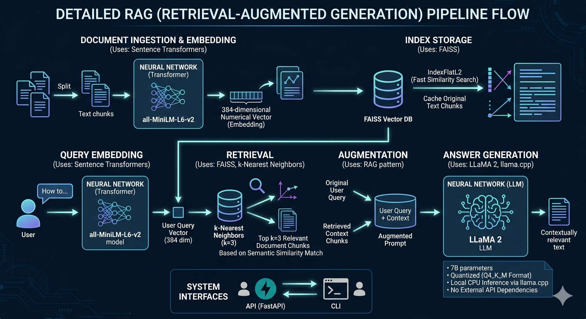

# LLaMA 2 RAG System

A Retrieval-Augmented Generation ([RAG](#rag-retrieval-augmented-generation)) system powered by [LLaMA 2](#llama-2), combining local LLM inference with [semantic search](#semantic-search) for question-answering.

## Overview

This project implements a [RAG](#rag-retrieval-augmented-generation) pipeline with the following steps:

1. **Document Ingestion & Embedding** (Uses: [Sentence Transformers](#sentence-transformers))
   - Documents are loaded and split into manageable chunks.
   - Each chunk is converted into a numerical vector ([embedding](#embeddings)) using the [all-MiniLM-L6-v2](#all-minilm-l6-v2) model (384 dimensions).

2. **Index Storage** (Uses: [FAISS](#faiss-facebook-ai-similarity-search))
   - [Embeddings](#embeddings) are stored in a [FAISS](#faiss-facebook-ai-similarity-search) [vector database](#vector-database) ([IndexFlatL2](#indexflatl2)) for fast similarity search
   - **Vector Index**: Numerical [embeddings](#embeddings) are stored in FAISS for fast similarity search (only stores vectors, not text)
   - **Text Cache**: Original document chunks are saved to [metadata.pkl](#metadatapkl) to preserve the actual text content.
   - **Why Cache?**: FAISS only stores vector representations; we need the original text to provide context to the LLM.
   - **How Used**: When retrieving similar chunks, we get vector IDs from FAISS, then lookup corresponding text from the pickle cache

3. **Query Embedding** (Uses: [Sentence Transformers](#sentence-transformers))
   - The user query is converted to a vector using the same embedding model for consistency.

4. **Retrieval** (Uses: [FAISS](#faiss-facebook-ai-similarity-search), [k-Nearest Neighbors](#k-nearest-neighbors))
   - Query vector is matched against the [IndexFlatL2](#indexflatl2) index using [Euclidean (L2) distance](#euclidean-l2-distance) to find the k=3 most similar document chunks.
   - These relevant chunks are extracted based on [semantic similarity](#semantic-search).

5. **Augmentation** (Uses: [RAG](#rag-retrieval-augmented-generation) pattern)
   - Retrieved context is combined with the original user query to create an augmented prompt
   - This provides the LLM with relevant background information

6. **Answer Generation** (Uses: [LLaMA 2](#llama-2), [llama.cpp](#llamacpp))
   - [LLaMA 2](#llama-2) (7B parameters, [quantized](#quantization) to [Q4_K_M Format](#q4_k_m-format)) processes the augmented prompt
   - Runs locally via [llama.cpp](#llamacpp) for CPU inference without external API dependencies
   - Generates contextually relevant answers based on the retrieved documents

The system supports both API ([FastAPI](#fastapi)) and CLI interfaces for easy integration.



## Project Structure

```
├── app.py                          # [FastAPI](#fastapi) server with /chat endpoint
├── rag.py                          # CLI interface for testing [RAG](#rag-retrieval-augmented-generation)
├── generator.py                    # [LLaMA 2](#llama-2) response generation
├── retriever.py                    # [FAISS](#faiss-facebook-ai-similarity-search)-based document retrieval
├── ingest.py                       # Build vector index from documents
├── pyproject.toml                  # Poetry dependency management
├── poetry.lock                     # Poetry lock file
├── LICENSE                         # Project license
├── README.md                       # This documentation
├── llama2-practice.faiss           # Built [FAISS](#faiss-facebook-ai-similarity-search) index
├── metadata.pkl                    # Cached document chunks for retrieval
├── assets/                         # Static assets
├── models/                         # Model files and weights
│   ├── llama-2-7b-chat.Q4_K_M.gguf # [LLaMA 2](#llama-2) model ([quantized](#quantization))
│   └── all-MiniLM-L6-v2/           # [Sentence transformer](#sentence-transformers) for [embeddings](#embeddings)
│       ├── config.json
│       ├── model.safetensors
│       ├── tokenizer.json
│       ├── vocab.txt
│       ├── onnx/                   # ONNX optimized models
│       ├── openvino/               # OpenVINO optimized models
│       └── 1_Pooling/              # Pooling layer configuration
└── vendors/                        # Third-party binaries and libraries
    └── llama-b7999/                # [llama.cpp](#llamacpp) binaries and shared libraries
        ├── llama-cli               # Command-line interface
        ├── llama-server            # HTTP server
        ├── libllama.so.0           # Core library
        └── ...                     # Additional binaries and libraries
```

## Features

- **Local LLM**: Runs [LLaMA 2](#llama-2) 7B locally without external APIs.
- **Vector Search**: [FAISS](#faiss-facebook-ai-similarity-search)-based [semantic search](#semantic-search) of relevant documents.
- **Context-Aware**: Generates answers using retrieved context.
- **[FastAPI](#fastapi)**: REST API for integration with other applications.

## Setup

### Prerequisites
- Python 3.10+

### Tested On
- **CPU**: AMD Ryzen 9 9950X (16 cores / 32 threads)
- **RAM**: 64 GB
- **Storage**: 2 TB
- **OS**: Ubuntu 24.04 (64-bit)
- **GPU**: None (CPU-only system with AVX/AVX2/AVX512 support)

### Installation

1. **Install Poetry**:
```bash
pip install setuptools poetry
```

1. **Create a Python 3.10 virtual environment** and activate it.

1. **Install dependencies with Poetry** (you can define a custom virtualenv name):
```bash
# set name before creating the environment
export POETRY_VIRTUALENVS_NAME="llama2-practice-poetry"
poetry install
```
   After installation you must execute code inside the poetry environment. Either:
   ```bash
   poetry env activate        # activate the environment (Poetry 2.x)
   poetry run python rag.py   # run a script directly
   ```
   
   (or install the `shell` plugin if you prefer the old `poetry shell` command)


1. **Populate gitignored files** (after cloning):

The following directories/files are gitignored and must be populated:

- **`models/llama-2-7b-chat.[Q4_K_M](#q4_k_m-format).gguf`** (~3.5GB)
  - Download from [Hugging Face](https://huggingface.co/TheBloke/Llama-2-7B-Chat-GGUF/blob/main/llama-2-7b-chat.Q4_K_M.gguf)
  - Place in `models/` directory

- **`models/all-MiniLM-L6-v2/`**
  - `hf download sentence-transformers/all-MiniLM-L6-v2 --local-dir ./models/all-MiniLM-L6-v2`

- **`vendors/llama-b7999/`** (precompiled [llama.cpp](#llamacpp) binaries)
  - Obtain from [llama.cpp releases](https://github.com/ggml-org/llama.cpp/releases)

- **`llama2-practice.faiss` and `metadata.pkl`** (generated)
  - Build the index after populating models:
  ```bash
  python ingest.py
  ```

## Usage

### API Server
Run inside the Poetry environment (or prefix with `poetry run`):
```bash
poetry run uvicorn app:app --reload
```

(installing a global `uvicorn` with apt is not recommended; the project dependency is managed by Poetry)

Send queries to the `/chat` endpoint:
```bash
curl -X POST http://localhost:8000/chat \
  -H "Content-Type: application/json" \
  -d '{"query": "What is Redis?"}'
```

### CLI Testing
```bash
python rag.py
```

Query the RAG system directly and print the response.

## Models

- **LLM**: LLaMA 2 7B Chat (quantized to Q4_K_M format)
- **Embeddings**: all-MiniLM-L6-v2 (384-dim sentence transformers)
- **Vector DB**: [FAISS](#faiss-facebook-ai-similarity-search) [IndexFlatL2](#indexflatl2)

## Configuration

Adjust in source files:
- `generator.py`: [LLaMA 2](#llama-2) parameters (n_threads, n_ctx, max_tokens)
- `retriever.py`: Number of retrieved chunks ([k](#k-nearest-neighbors)=3)
- `ingest.py`: Chunk size and overlap (500 chars, 50 overlap)

## Glossary

### Technical Terms

#### RAG (Retrieval-Augmented Generation)
A technique that combines document retrieval with generative language models. Instead of relying solely on pre-trained knowledge, RAG retrieves relevant documents and uses them as context to generate more accurate and grounded responses.

#### FAISS (Facebook AI Similarity Search)
An open-source library by Meta for efficient similarity search in high-dimensional spaces. Used here to quickly find semantically similar document chunks given a user query.

#### LLaMA 2
Meta's open-source large language model (7 billion parameters in this project). Runs locally without external API calls for complete privacy.

#### Embeddings
Numerical vector representations of text that capture semantic meaning. Text with similar meaning has nearby vectors in [vector database](#vector-database) space, enabling [semantic search](#semantic-search).

#### Sentence Transformers
A framework that fine-tunes transformer models to produce sentence-level [embeddings](#embeddings). The [all-MiniLM-L6-v2](#all-minilm-l6-v2) model creates 384-dimensional vectors for efficient [semantic search](#semantic-search).

#### all-MiniLM-L6-v2
A pre-trained sentence transformer model from Hugging Face. Creates 384-dimensional [embeddings](#embeddings) from text input, optimized for semantic similarity search while maintaining a small model size for fast computation. Used in this project for converting both documents and queries into vectors.

#### Vector Database
A database optimized for storing and searching high-dimensional vectors ([embeddings](#embeddings)). [FAISS](#faiss-facebook-ai-similarity-search) is the vector database used in this project.

#### Q4_K_M Format
A [quantization](#quantization) scheme that compresses the [LLaMA](#llama-2) model from 32-bit floats to 4-bit integers, reducing memory usage from ~13GB to ~3.5GB while maintaining quality.

#### Quantization
Reducing the precision of model weights (e.g., from 32-bit to 4-bit) to decrease memory footprint and increase inference speed. Essential for running large models on consumer hardware. See [Q4_K_M Format](#q4_k_m-format).

#### llama.cpp
A C++ implementation optimized for efficient CPU inference of [LLaMA](#llama-2) models. Provides dramatic speed improvements on CPU-only systems.

#### metadata.pkl
A Python [pickle file](#pickle-file) that stores the original text chunks from documents after they have been processed and split. While [FAISS](#faiss-facebook-ai-similarity-search) stores only numerical [embeddings](#embeddings) for fast similarity search, this file preserves the actual text content needed to provide context to the LLM during answer generation.

#### Pickle File
A file created using Python’s `pickle` module that serializes (writes) and deserializes (reads) Python objects to disk. In this project, `metadata.pkl` is a pickle file which stores processed chunks and metadata for fast lookup during retrieval.

#### Semantic Search
Finding documents by meaning rather than exact keyword matching. Uses [embeddings](#embeddings) to compute similarity between a query and document vectors.

#### k-Nearest Neighbors
A retrieval strategy that returns the k most similar documents to a query. Here, the 3 most relevant chunks are retrieved for context.

#### IndexFlatL2
A [FAISS](#faiss-facebook-ai-similarity-search) index type using [Euclidean (L2) distance](#euclidean-l2-distance) to measure similarity between vectors. Provides exact nearest neighbors search.

#### Euclidean (L2) Distance
A distance metric that measures the straight-line distance between two points in Euclidean space. For vectors A and B, it's calculated as √(Σ(Aᵢ - Bᵢ)²). Used in [FAISS](#faiss-facebook-ai-similarity-search) to determine how similar two [embeddings](#embeddings) are - smaller distances indicate higher similarity. Also known as L2 norm or Euclidean norm.

#### FastAPI
A modern Python web framework for building REST APIs with automatic documentation and type validation.
